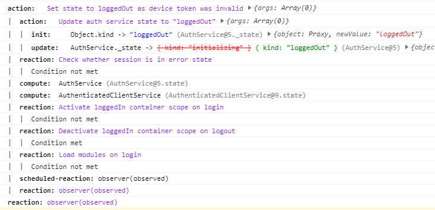
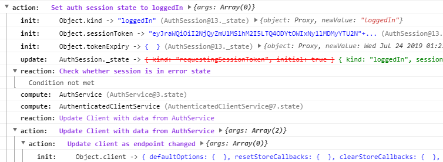

# Knuddels Mobx Console Logger

## Installation

```
yarn add @knuddels/mobx-logger
```

or

```
npm install @knuddels/mobx-logger --save
```

## Usage

```ts
import { MobxConsoleLogger } from "@knuddels/mobx-logger";
import * as mobx from "mobx";

const logger = new MobxConsoleLogger(mobx);

// ...

logger.dispose(); // Stops logging mobx events
```

This is how it looks in the chrome dev tools console:



This is how it looks with grouping enabled:



Groups are delayed by default so that empty groups appear as plain text.

## Why

-   Not Mobx Dev Tools?
    The mobx chrome dev tools are a little bit buggy and most importantly
    don't track events that happen during page initialization.
    Moreover, they don't integrate ordinary console logs.

-   Not `mobx-logger`?
    It does not look as great and does not process all events from mobx.
    Besides, it creates a console group for each nesting which makes filting in chrome almost useless as chrome does not filter groups.

## Similar libs

-   [mobx-logger](https://github.com/winterbe/mobx-logger): Inspired this library.

## Changelog

-   1.1.0 - Implements Groups.
-   1.0.0 - Initial release.
